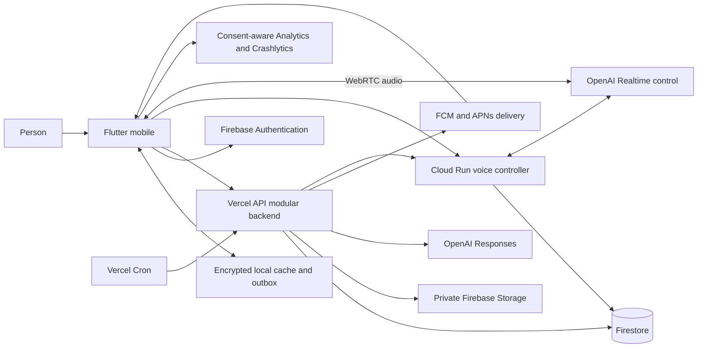

# System architecture

Status: proposed, 2026-09-16. Official references were checked for this design; see [sources](SOURCES.md). All deployment and package choices below are proposals, not provisioned resources.

## Architectural decision record

| Decision | Selected approach and reason | Tradeoff / reconsideration trigger |
| --- | --- | --- |
| ADR-01 | Flutter/Dart feature-oriented mobile app with repository boundaries | Native plugins still need real-device and OS lifecycle tests |
| ADR-02 | Firebase Authentication, Firestore, Storage, FCM, Analytics and Crashlytics | Managed platform coupling; isolate persistence and telemetry adapters |
| ADR-03 | Modular TypeScript/Node backend on Vercel; one deployable API | Bounded function runtime; durable jobs must outlive individual requests |
| ADR-04 | All business reads/writes through authenticated API; client Firestore deny-all | Additional API hops and custom offline sync, but one authorization/validation path and atomic aggregate invalidation |
| ADR-05 | Drift/SQLite local cache and outbox, encryption implementation gated in P1 | Additional sync responsibility; no parallel Firestore offline cache |
| ADR-06 | OpenAI Responses API for bounded stateless text requests; application-owned history | More explicit context management; better erasure and provider portability |
| ADR-07 | Structured memory and evidence references, no vector database initially | Filtered bounded retrieval first; evaluate vector retrieval only after measured recall failures |
| ADR-08 | Vercel Cron drives Firestore durable jobs and notification work | Eventual execution and no exact-time promise; move worker execution only when throughput requires it |
| ADR-09 | Cloud Run voice controller for production OpenAI sideband; WebRTC media goes directly to OpenAI | One additional runtime justified by long-lived control, recovery and cost enforcement; re-evaluate Vercel stable support at P8 |
| ADR-10 | Deterministic aggregates before AI interpretations | More metric specifications; avoids trusting model arithmetic |

ADR-04 deliberately does not rely on mobile Firestore synchronization. [Firestore offline documentation](https://firebase.google.com/docs/firestore/manage-data/enable-offline) describes automatic caching and last-write-wins behavior; explicit conflict handling is more appropriate for this design's cross-device edits, deletion and derived-data invalidation.

## System boundaries



Trust boundaries are the untrusted device, public API edge, privileged backend, persistence services and external AI processor. Flutter never receives an OpenAI permanent key, Firebase Admin credential, internal scheduler credential or broad storage capability. The voice controller uses the same principal checks and scoped repositories as the API.

## Technology stack

| Concern | Choice | Why |
| --- | --- | --- |
| Mobile UI/domain | Stable Flutter/Dart, Material 3 adapted for both platforms | Shared UI and typed domain; platform-specific capabilities behind ports |
| State / DI | Riverpod Notifier/AsyncNotifier and provider overrides | Testable state transitions and lifetime-scoped dependencies |
| Navigation | go_router | Declarative routing, guarded entry and deep links |
| Serialization / immutable state | json_serializable, Freezed where unions improve clarity | Explicit typed boundaries and generated serialization in implementation phase |
| HTTP | Dio with restricted retry/auth interceptors | Cancellation, timeouts and consistent API transport |
| Local data | Drift/SQLite with validated encryption adapter | Transactions for local data and outbox; schema migrations |
| Identity/device services | FlutterFire Auth, App Check, Messaging, Analytics, Crashlytics | Official Firebase integration; no mobile Admin SDK |
| Backend | TypeScript strict mode, supported Node LTS, Vercel Node Functions | Firebase Admin compatibility and shared modules; no web UI framework required |
| Validation/contracts | Zod runtime schemas; future OpenAPI 3.1 contracts | Reject unknown fields and keep client/server DTOs aligned |
| AI | Official OpenAI Node SDK, Responses and Realtime adapters | Encapsulate model parameters, timeouts, safety and metering |
| Tests | Flutter test/integration_test; Node test runner or Vitest; Firebase Emulator Suite | Fast pure tests, contract tests and security enforcement tests |

Select and pin a mutually compatible stable dependency set in P1. This task creates no lockfiles or package manifests. [Flutter architecture guidance](https://docs.flutter.dev/app-architecture/recommendations) supports separating UI and data layers, repositories and dependency injection; Riverpod is this project's selection, not a Flutter mandate.

## Proposed repository layout

```text
apps/mobile/lib/app/                     bootstrap, router, app lifecycle
apps/mobile/lib/core/                    transport, sync, persistence, errors, design
apps/mobile/lib/features/<feature>/      presentation, application, domain, data
apps/mobile/test/                        domain and widget tests
apps/mobile/integration_test/            mobile workflows
services/api/api/                        thin Vercel entry points
services/api/src/modules/                profile, tracking, goals, habits, scheduling
services/api/src/ai/                     context, memory, safety, OpenAI adapter
services/api/src/jobs/                   durable job handlers and reconciliation
services/api/src/platform/               auth, Firestore, Storage, FCM, logging
services/voice/                          long-lived session lifecycle adapter
packages/backend-domain/                shared server policy, DTOs and ports
contracts/                              versioned OpenAPI and fixture schemas
firebase/                               future rules and indexes
docs/                                   this blueprint
.github/workflows/                      future CI/CD definitions
```

Only documentation exists now. Avoid a workspace build orchestrator until builds justify one. API and voice share backend modules without calling each other for every domain operation. Do not split tracking modules into microservices.

## Backend processing and ownership

Request pipeline: request ID → size/content-type limits → Firebase ID token verification → App Check verification → active-account/consent check → quota reservation → typed validation → UID-scoped use case → transaction or provider call → redacted outcome. UID comes from verified authentication, never a trusted request body field. See [API](API_SPECIFICATION.md) and [security](SECURITY_MODEL.md).

| Client responsibilities | Server responsibilities |
| --- | --- |
| Presentation, accessibility, input guidance and unit display | Canonical units, validated ranges, ownership and schema invariants |
| Local cache, drafts, queued mutations and pending-state UI | Authoritative mutations, revisions, sync sequence and idempotency |
| Local reminder execution and OS permissions | Recurrence authority, server delivery jobs and device registration |
| User-confirmed AI actions | Tool allowlist, source validation, context, memory and metering |
| Microphone/audio route and WebRTC | Voice session policy, control events, authorized tools and usage |

Every business mutation transaction writes the entity, an incremented user sync sequence, a change-feed entry, and relevant dirty-period/job markers together. Expensive processing never runs inside a transaction. Analytics, memory invalidation and notifications consume persisted jobs. Retrying a job must yield the same logical result. Firestore transaction callbacks may run repeatedly; never call OpenAI or FCM from them. See [transaction documentation](https://firebase.google.com/docs/firestore/manage-data/transactions).

Jobs live in Firestore, with state, attempt count, next attempt, lease token and expiry. Cron handlers claim bounded batches transactionally, process within a deadline and checkpoint. A later invocation reclaims expired leases. Dead-letter jobs remain visible to operators. Fire-and-forget promises and post-response execution are not durable queues. Vercel Cron does not automatically retry failed invocations; application retry state is required. See [Cron behavior](https://vercel.com/docs/cron-jobs/manage-cron-jobs).

## Offline synchronization and conflict model

Local save transaction updates the optimistic projection and outbox. A stable operation ID is generated once. Reconnect replays operations per entity in order with bounded cross-entity concurrency. The backend commits only when the submitted base revision matches. A conflict returns current revision and a safe representation for resolution; the client keeps both drafts and asks which to retain. Independent append-only log creates use distinct IDs; retrying one operation cannot duplicate it.

After sending pending operations, fetch changes after the last acknowledged server sequence. Apply each page and persist its cursor in one local transaction. Tombstones remove cached objects and invalidate dependent local charts. Gaps older than the feed retention require a full snapshot rebuild. Preserve pending drafts separately while rebuilding. See exact cursor/snapshot rules in [API specification](API_SPECIFICATION.md).

AI requires connectivity and uses only confirmed server data. A pending local entry is marked as not yet visible to the coach; the user may synchronize first. No silent upload of queued conversation prompts or audio after reconnection.

## Reliability and migration

Use explicit deadlines, jittered retries only for safe operations, circuit breakers for AI outages, and content-free error messages with request IDs. Tracking remains available during AI failure. Backend downtime allows cached viewing and durable local tracking; scheduling changes show pending until accepted.

Firestore document versions and API versioning allow expand/migrate/contract releases. Keep old mobile contracts working for at least the supported release window, initially two prior mobile versions and 90 days, whichever is longer. No destructive schema migration until adoption is verified. Repository ports prevent Firestore types from entering domain entities. Exports use portable JSON/CSV and stable timestamps rather than Firestore serialization.

Choose deployment locations only after launch-region and residency review. Co-locate Vercel execution, Firestore, Storage and voice controller as closely as supported. Cross-provider latency and egress are budgeted. A Firestore location is a consequential provisioning decision, not something to defer after real users arrive.

## Current voice runtime evidence

[Vercel WebSockets](https://vercel.com/docs/functions/websockets) are documented as beta at review time; do not rely on historical statements that Vercel cannot support WebSockets. [Vercel function duration limits](https://vercel.com/docs/functions/limitations) also remain relevant. The proposed voice controller uses [Cloud Run WebSocket support](https://docs.cloud.google.com/run/docs/triggering/websockets), bounded application sessions and reconnect handling. Cloud Run does not make a socket durable across instance loss. Details and fallback are in [voice architecture](VOICE_ARCHITECTURE.md).
