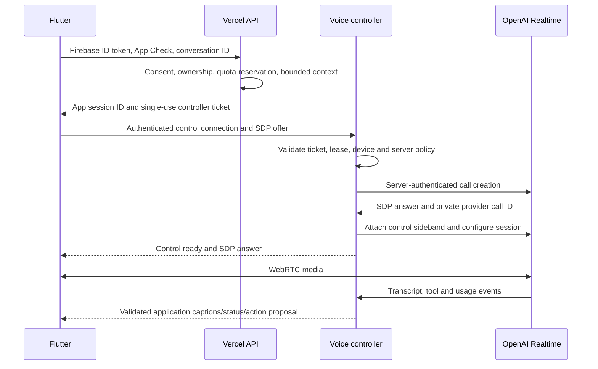

# Realtime voice architecture

Status: proposed, 2026-09-16. Covers FR-19. This is a design, not an implemented or clinically validated voice system.

## Recommended transport and current official guidance

Use OpenAI Realtime with WebRTC between Flutter and OpenAI for media. Official documentation currently demonstrates `gpt-realtime-2.1`; treat it as the evaluation candidate and revalidate account availability, model lifecycle and pricing in P8. The documentation also offers GPT-Live as a distinct architecture; this design intentionally uses the documented Realtime call/session path rather than mixing event schemas between families. [Realtime overview](https://developers.openai.com/api/docs/guides/realtime).

Use the documented server-brokered SDP flow: backend submits offer plus server-selected session configuration to `/v1/realtime/calls` using its permanent credential, obtains the answer and retains the call identifier. An ephemeral client secret is an officially supported alternative, but is not necessary for this selected flow. Neither a permanent key nor a provider token is sent to the mobile app. [OpenAI WebRTC](https://developers.openai.com/api/docs/guides/voice-webrtc).

The controller attaches a server-side WebSocket to the call for tools and session control. Audio remains on WebRTC. [Server-side controls](https://developers.openai.com/api/docs/guides/voice-server-controls) distinguish the sideband from media and explain that attachment alone does not make events private. Do not treat the mobile client or model as an authorization boundary.

## Why a separate runtime

Vercel remains the main HTTP API and owns initial authentication, budget admission and context preparation. A small Cloud Run controller owns the long-lived control socket, application event connection and session lifecycle. It reuses backend-domain modules and Firestore; it is not an independent microservice domain.

This exception is justified by continuous control, trusted transcript ingestion, private tools and runtime recovery for up to 10-minute voice sessions. [Vercel WebSockets](https://vercel.com/docs/functions/websockets) are currently beta; [function limits](https://vercel.com/docs/functions/limitations) require runtime-specific verification. [Cloud Run WebSocket guidance](https://docs.cloud.google.com/run/docs/triggering/websockets) supports this connection model but still requires bounded requests and reconnection. Configure request timeout above the application cap, maintain work within a live request, and do not assume instance affinity or immortality.

P8 must reconsider whether stable Vercel capabilities can satisfy the same control, recovery and cost requirements. If so, deploy the controller adapter there and remove Cloud Run. If realtime fails its safety/runtime gate, retain text and offer a separately reviewed push-to-talk transcription → validated text answer → speech pipeline; do not label that full-duplex realtime completion.

## Session establishment

The controller ticket is short-lived (initially 60 seconds), one-use, audience-bound, session/UID/device-bound and stored only in memory. Consume it transactionally. Ticket expiry controls admission, not call duration. Firebase and App Check checks are repeated at controller admission or represented by a short-lived signed service assertion; never trust unsigned headers forwarded from the client.

Send the SDP offer as the first typed message on the authenticated application WebSocket. Its connection-owning controller performs provider HTTP signaling and owns the sideband for the entire live request. Do not split setup and control across independent requests while assuming they reach the same Cloud Run instance. Persist lifecycle metadata for recovery, not an in-memory routing assumption. Ending the application connection initiates provider hangup.

Accept only required SDP audio media. Reject an offered application data channel server-side for this design, so modified clients cannot inject provider session updates/tool results. The mobile app receives captions and typed controls over the application's authenticated control connection. Validate SDP policy and provider compatibility in the P8 spike; do not rely on removing the channel only in Flutter. Keep microphone muted until server control is ready. Session configuration, tools and model selection come from server allowlists, not SDP/client metadata.

## Lifecycle, permissions and interruptions

States: idle → requestingPermission → authorizing → connecting → listening/speaking → reconnecting or ending → ended. Any state can enter failed with a typed reason and a visible recovery action. Allocate resources on connect and release microphone tracks, peer connection, timers and audio focus on every exit path.

Ask for microphone access just in time with a clear explanation. Denial leaves text coach usable; permanent denial provides OS-settings guidance. Show a persistent listening indicator and distinct mute/end controls. No background recording. App backgrounding, phone call, audio-focus loss, logout, account deletion or AI consent revocation ends or safely suspends the call; initial policy is to end and require explicit restart.

Use platform audio-session routing, echo cancellation and Bluetooth/headset tests. Offer push-to-talk when voice activity detection performs poorly. Silence timeout and visible remaining session time reduce accidental recording. Do not log media buffers or SDP, which can contain network information.

Barge-in stops playback and cancels the current response. Align retained conversation with what was actually played, using the selected Realtime model's interruption/truncation semantics; test this against the [Realtime conversation lifecycle](https://developers.openai.com/api/docs/guides/realtime-conversations). Mark interrupted responses as incomplete, never as fully heard advice. Transcript events are not proof of what the user heard and speech recognition is not guaranteed exact.

## Context, tool calls and memory

Before a call, retrieve the same minimal verified context used by text coaching, with a smaller initial voice budget (proposed 4,000 input tokens). Supply active goals, essential preferences and relevant recent summaries; do not preload a lifetime transcript. Retrieve additional bounded facts only on tool demand. User can see the context date/freshness in the app.

Controller tool calls always resolve against the ticket-bound UID, current consent and the session's server lease. All proposed mutations require app confirmation through the normal action-proposal API. No client-supplied tool output is considered authoritative. Persist finalized transcript turns received through the server connection with unique provider event/turn IDs; deduplicate re-delivery. Microphone audio is transient. Failed/partial transcripts do not automatically become facts or long-term memory.

At end, enqueue bounded conversation summarization and memory candidates only if relevant consent remains active. AI observations stay observations. Revocation/deletion bumps epoch, signals active controllers and invalidates context before any subsequent tool execution or persistence.

## Network loss and controller failure

Client network loss immediately mutes capture and stops playback. Attempt at most two short reconnects to the application controller; a failed provider call is replaced with a new call after old-call hangup/reconciliation. Explain that unsent speech was not saved. Never replay buffered audio automatically and never pretend the session resumed word-for-word.

The controller renews a Firestore lease/heartbeat; proposed heartbeat every 10 seconds, lease expiry after 30 seconds. On loss of sideband or lease, it ends the provider call and tells the app to use text. On process crash this cannot be instantaneous: a separate Vercel reconciliation job scans stale active sessions and calls the provider hangup endpoint. Budget for the worst credible interval until reconciliation, and verify provider call termination behavior in P8. New session admission is denied while an old unresolved call may still consume budget.

Use the provider's [call hangup operation](https://developers.openai.com/api/reference/resources/realtime/subresources/calls/methods/hangup) for server termination and test retries/already-ended outcomes. A crash after call creation but before its ID is persisted is an explicit failure case: keep admission reserved, stop the client, and reconcile within a tested provider lifecycle bound. Do not promise a hard ten-minute provider cutoff until that case is demonstrated; if the bound cannot be enforced acceptably, realtime cannot pass P8.

Do not assume automatic replay of missed provider events after sideband reconnection. Store finalized events as they arrive; mark possible gaps. Reconstruct a new session from verified stored context rather than inventing missing transcript. Test controller restart, instance scale-down, airplane mode, Wi-Fi/cellular switch and simultaneous logout.

## Cost, security and safety

Initial application policies: one call per user, 10-minute maximum, 60-second idle timeout, warning at one minute remaining, configured daily allowance and project kill switch. Reserve the maximum permitted session cost before admission, including a controller-failure allowance; reconcile using server-observed usage. Do not rely on client-reported seconds or token expiry to stop a running call. Expensive model/voice options are not client-selectable.

Prompt safety and server monitoring reduce risk but realtime audio can be spoken before a downstream classifier intervenes. This residual risk is stronger than buffered text. Restrict the coach to general wellbeing, suppress autonomous changes, cancel/escalate concerning turns, and require qualified safety review and adversarial voice evaluation. If these do not meet release criteria, use the buffered speech pipeline for production until remediation; a disclaimer alone is insufficient.

Provider keys remain in server secret stores, separate per environment. Authenticate controller traffic with TLS and short-lived tickets; service-to-service calls use workload identity where possible. Rate-limit setup and SDP size. Use a protected server-only providerCallId; it is not user authorization. No public transcript, recording URL or sensitive crash breadcrumbs. See [security model](SECURITY_MODEL.md) for provider retention and account erasure.
